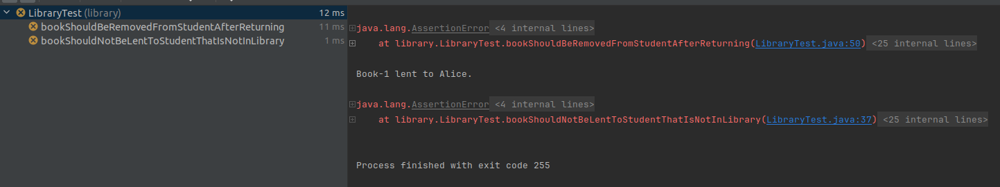
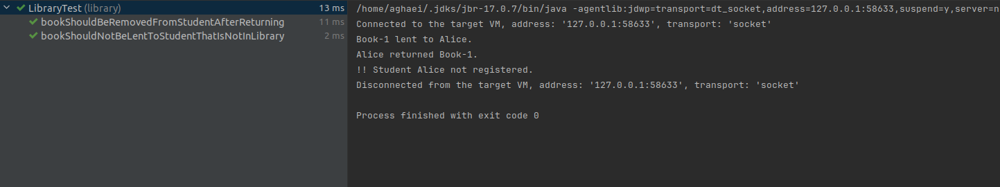

<div dir="rtl">

# پرسش‌ها

## آزمایش ابتدایی برای گرفتن پوشش آزمون
طبق صورت سوال، همانطور که خواسته شده بود، پوشش آزمون را برای پروژه‌ی داده شده (که json-simple نام داشت) اجرا کردیم. با توجه به عکس زیر، وارد پوشه‌ی سورس و بعد تست شده، در نهایت نیز وارد کلاس testJason می‌شویم. حال در این کلاس در خط ۱۶، کلیک راست کرده و گزینه‌ی Run TestJason With Coverage را می‌زنیم:


همانطور که مشاهده میکنید در عکس بعدی خروجی آن قایل مشاهده می‌باشد:


## TDD-Part1
۲ مشکل در کد وجود دارد که برای هرکدام جداگانه ابتدا تست می‌نویسیم:
مشکل اول: کتاب می‌تواند به یک دانش‌آموز که عضو کتابخانه نیست نیز قرض داده شود.

<div dir="ltr">

```java
    @Test
    public void bookShouldNotBeLentToStudentThatIsNotInLibrary() {
        //Arrange
        library.addStudent(student1);
    
        //Act
        library.lendBook(book1, student2);
    
        //Assert
        Assert.assertFalse(student2.hasBook(book1));
}
```
<div dir="rtl">
مشکل دوم: کتاب پس از بازگشت، از لیست کتاب‌های دانش‌ اموز حذف نمی‌شود.
<div dir="ltr">

```java
    @Test
    public void bookShouldBeRemovedFromStudentAfterReturning() {
        //Arrange
        library.addStudent(student1);
        library.lendBook(book1, student1);
    
        //Act
        library.returnBook(book1, student1);
    
        //Assert
        Assert.assertFalse(student1.hasBook(book1));
}
```
<div dir="rtl">
در ابتدا هردو این تست fail می‌شوند.


حال کد را تغییر می‌دهیم و می‌بینیم که هردو تست پاس می‌شوند.



## پرسش اول

روش TDD را با روش تست کردن سنتی که در آن بعد از نوشتن برنامه، تست‌ها نوشته می‌شوند،
از نظر نوع پروژه‌هایی که هر یک برای آن‌ها مناسب هست، مقایسه کنید.


### روش سنتی
در روش سنتی توسعه نرم‌افزار، ابتدا کد نوشته می‌شود و سپس تست‌ها برای بررسی و اطمینان از درستی عملکرد کد نوشته و اجرا می‌شوند.

#### مزایا:
1. **سرعت اولیه بالا**: از آنجایی که در هنگام نوشتن کد، لازم نیست که تمرکز توسعه دهنده بین نوشتن تست و کد تقسیم شود،
سرعت توسعه بالاتر می‌رود.
2. **تمرکز بر توسعه ویژگی‌ها**: تمرکز اصلی روی پیاده‌سازی ویژگی‌ها و منطق کسب و کار است و
تست‌ها به عنوان یک مرحله پس از توسعه در نظر گرفته می‌شوند.

#### معایب:
1.  **شناسایی مشکلات در مراحل بعدی**: با توجه به اینکه تست‌ها پس از کد نویسی نوشته می‌شوند،
    (به قولی afterthought هستند )
مشکلات و باگ‌ها ممکن است دیرتر شناسایی شوند.
2. **هزینه بیشتر دیباگ**: رفع باگ‌های شناسایی شده در مراحل بعدی توسعه ممکن است زمان و هزینه بیشتری را بگیرد.
مخصوصا اگر در توسعه‌ی کد خیلی خوب عمل نکرده باشیم و اصولی مثل SOLID را رعایت نکرده باشیم،
ممکن است مجبور شویم برای درست کردن یک قسمت از کد، زمان زیادی را صرف کنیم، و یا قسمت‌های زیادی از کد را تغییر دهیم
که خودش مستعد ایجاد باگ جدید است.
3. **پوشش پایین**: ممکن است برخی از قسمت‌های کد بدون تست باقی بمانند یا تست‌های کافی برای آنها نوشته نشود.

#### مناسب برای:
- پروژه‌های کوچک با پیچیدگی کم.
- پروژه‌هایی که نیاز به تحویل سریع دارند و زمان کمی برای نوشتن تست‌های اولیه موجود است.
- ساختن prototypeها که وجود باگ در آن‌ها اهمیتی ندارد و بلکه می‌خواهیم سریعا یک نمونه از محصول داشته باشیم
تا از مشتری نظر بگیریم.

### روش Test Driven Development (TDD)
در TDD، ابتدا تست‌ها نوشته می‌شوند و سپس کد به گونه‌ای نوشته می‌شود که تست‌ها پاس شوند.
این فرآیند در چرخه‌ای تکراری (تست، کد، ریفکتور) انجام می‌شود.

#### مزایا:
1. **کیفیت بالاتر کد**: به دلیل تمرکز بر نوشتن تست‌ها قبل از کد، کد نهایی از کیفیت بالاتری برخوردار خواهد بود.
2. **شناسایی زودهنگام باگ‌ها**: با نوشتن تست‌ها قبل از کد، بسیاری از باگ‌ها و مشکلات در مراحل اولیه شناسایی می‌شوند.
3. **پوشش بالا**: تضمین می‌شود که تمامی قسمت‌های کد تست شده‌اند و هیچ بخشی بدون پوشش تست باقی نمی‌ماند.
4. **ریفکتور آسان‌تر**: امکان ریفکتور کردن کد با اطمینان بیشتر،
زیرا تست‌ها کمک می‌کنند تا اطمینان حاصل شود که تغییرات کد باعث ایجاد مشکلات جدید نمی‌شود.

#### معایب:
1. **هزینه‌ی اولیه‌ی بالا**: نوشتن تست‌ها قبل از کد زمان بیشتری نیاز دارد.
2. **نیاز به تخصص**: تیم توسعه باید مهارت و تخصص لازم در نوشتن تست‌ها و پیاده‌سازی TDD را داشته باشد.
3. **سختی در پیاده‌سازی در پروژه‌های بزرگ و پیچیده**: پیاده‌سازی TDD در پروژه‌های بزرگ ممکن است پیچیده و زمان‌بر باشد.

#### مناسب برای:
- پروژه‌های بزرگ و پیچیده که کیفیت کد و شناسایی زودهنگام باگ‌ها اهمیت بالایی دارند.
- پروژه‌هایی که نیاز به نگهداری و ریفکتور مستمر دارند، چرا که TDD کمک می‌کند تا این فرآیندها با اطمینان بیشتری انجام شوند.
- شرایطی که کیفیت کد برایمان اهمیت بیشتری از تجاری‌سازی سریع محصول و جلوتر بودن از رقبا دارد.

## پرسش دوم

در فرایند ایجاد نرم‌افزار هم تیم ایجاد (Development Team) و هم تیم تضمین کیفیت (QA Team) وظیفه تست نرم‌افزار را برعهده دارند. 
هر کدام از این تیم‌ها بیش‌تر با کدام دسته از انواع تست سروکار دارد؟ چرا؟ انواع تست ذکر شده را به طور مختصر شرح دهید.

### تیم ایجاد (Development Team)

تیم توسعه معمولاً با تست‌هایی که به توسعه کد و تأیید صحت عملکرد اجزاء و ماژول‌ها مرتبط هستند، سروکار دارد. این تست‌ها عبارتند از:

#### تست واحد (Unit Testing) 

این تست‌ها برای ارزیابی عملکرد هر بخش کوچک و مجزا از کد (مانند توابع، متدها یا کلاس‌ها) نوشته می‌شوند.
تست واحد به توسعه‌دهندگان کمک می‌کند تا مطمئن شوند که هر جزء کوچک کد به درستی کار می‌کند و بدون خطا است.
همچنین در TDD هم از این نوع تست استفاده می‌شود.

#### تست یکپارچگی (Integration Testing)
این تست‌ها به بررسی نحوه تعامل و همکاری ماژول‌ها و اجزاء مختلف نرم‌افزار با یکدیگر می‌پردازند.
توسعه‌دهندگان از این تست‌ها برای اطمینان از اینکه اجزاء مختلف به درستی با هم ادغام شده‌اند 
و داده‌ها به طور صحیح بین آن‌ها منتقل می‌شود، استفاده می‌کنند.

### تیم تضمین کیفیت (QA Team)

تیم تضمین کیفیت معمولاً با تست‌هایی که برای بررسی و ارزیابی کیفیت کلی نرم‌افزار و عملکرد آن در شرایط واقعی طراحی شده‌اند،
سروکار دارد.

#### تست عملکرد (Performance Testing)

این تست‌ها به بررسی سرعت، پاسخ‌گویی، و پایداری نرم‌افزار در شرایط بارگذاری مختلف می‌پردازند.
تیم QA از تست عملکرد برای اطمینان از اینکه نرم‌افزار در شرایط واقعی و تحت بار سنگین به درستی کار می‌کند، استفاده می‌کند.

#### تست پذیرش (Acceptance Testing)
این تست‌ها به بررسی اینکه آیا نرم‌افزار تمامی نیازمندی‌های کسب و کار و مشتری را برآورده می‌کند یا نه، می‌پردازند.
تیم QA از این تست‌ها برای تأیید نهایی قبل از تحویل نرم‌افزار به مشتری استفاده می‌کند 
تا اطمینان حاصل کند که نرم‌افزار آماده استفاده است.

#### تست رگرسیون (Regression Testing)
این تست‌ها برای بررسی این است که تغییرات جدید در نرم‌افزار 
(مانند افزودن ویژگی‌های جدید یا رفع باگ‌ها) تأثیر منفی بر عملکرد قسمت‌های دیگر نداشته باشد.
تیم QA از تست رگرسیون برای اطمینان از اینکه کد جدید باعث بروز خطاها یا مشکلات جدید در نرم‌افزار نمی‌شود، استفاده می‌کند.

#### تست سیستم (System Testing)
این تست‌ها کل سیستم نرم‌افزاری را به عنوان یک واحد کامل تست می‌کنند تا از درستی عملکرد آن اطمینان حاصل کنند.
تیم QA از تست سیستم برای ارزیابی کلی عملکرد، امنیت، و قابلیت اطمینان نرم‌افزار استفاده می‌کند.

### نتیجه‌گیری

به طور کلی می‌توانیم بگوییم که تیم توسعه، وظیفه‌ی validation را بر عهده دارد و تست می‌کند که آیا کدی که نوشته کار می‌کند یا خیر
در حالی که تیم QA، عملا دارد verification را انجام می‌دهد و بررسی می‌کند که محصول نهایی آیا با ویژگی‌های کیفی مورد نظر مشتری
و همچین خواسته‌های مشتری مطابقت دارد یا خیر.

</div>
